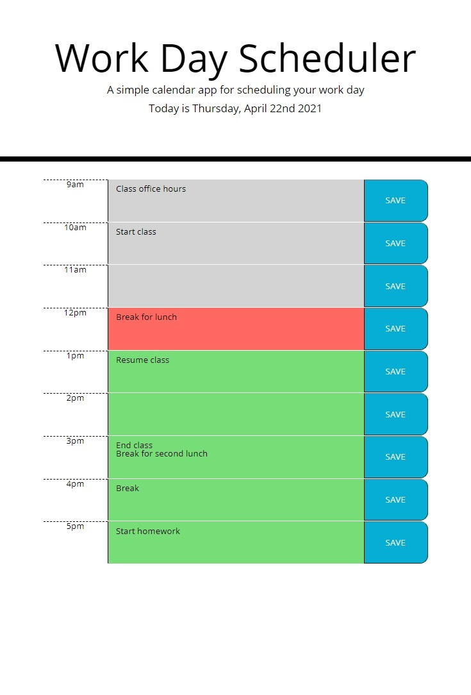

# Planneroni

A daily planner that keeps track of your to-do's and what time of day it is. Upcomign events are green, present events are red, and past events are grey. Saves to localStorage so that it is persistent across sessions. Clears events daily.

Deployed repo: https://jlamonade.github.io/planneroni/

